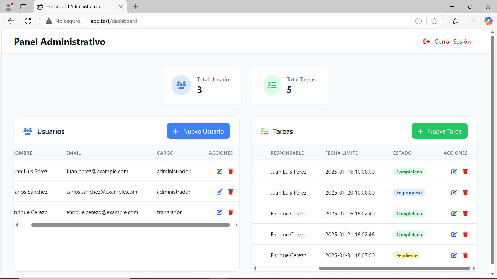
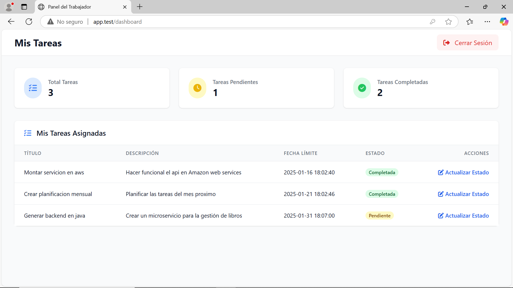

# Task-Master

Task-Master es una aplicación simple en PHP que utiliza el patrón MVC y POO para la gestión de tareas. La aplicación cuenta con dos módulos principales:

- **Módulo Administrador**: Permite manejar usuarios y tareas, asignar tareas, eliminar tareas, etc.
- **Módulo Trabajador**: Los trabajadores pueden ver las tareas asignadas a ellos y modificar el estado de las mismas.

## Instalación

Para instalar la aplicación, sigue estos pasos:

1. Clona el repositorio en tu máquina local:
    ```bash
    git clone https://github.com/fer-gc05/Task-Master.git
    ```
2. Copia el proyecto a la carpeta de tu servidor Apache.
3. Configura tu servidor Apache para apuntar a la carpeta del proyecto.
4. Asegúrate de tener configurada la base de datos y las credenciales necesarias en el archivo de configuración del proyecto.

## Uso

Una vez instalada la aplicación, puedes acceder a ella a través de tu navegador web. Dependiendo del rol con el que inicies sesión, tendrás acceso a diferentes funcionalidades:

- **Administrador**: Podrás gestionar usuarios y tareas, asignar tareas, eliminar tareas, etc.
- **Trabajador**: Podrás ver las tareas asignadas a ti y modificar el estado de las mismas.

## Vistas

- **Vista Administrativa:**
  


- **Vista Rol Trabajador:**
  


- **Para seguir viendo el resto de vistas entra a la carpeta [image](image/)**
